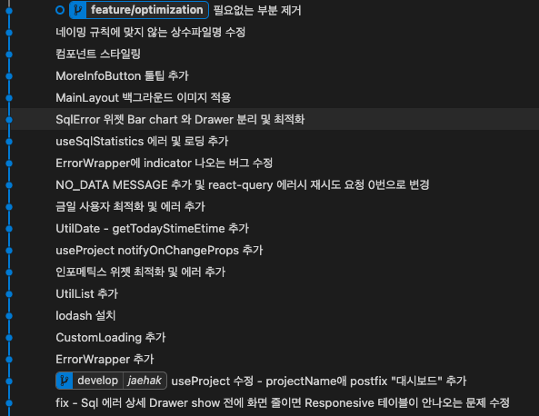

# Monitoring

<p align="center">
  
</p>

- [Monitoring](#monitoring)
  - [소개](#소개)
  - [설치 및 실행환경](#설치-및-실행환경)
  - [과제 요구 사항](#과제-요구-사항)
    - [1주차 피드백](#1주차-피드백)
    - [2주차 피드백](#2주차-피드백)
  - [제약 조건](#제약-조건)
  - [주요 프레임워크 및 라이브러리](#주요-프레임워크-및-라이브러리)
  - [폴더 구조](#폴더-구조)
  - [주안점](#주안점)
    - [1. 모니터링 서비스로 어떤 것을 사용자에게 제공해야 할까요? 🤔](#1-모니터링-서비스로-어떤-것을-사용자에게-제공해야-할까요-)
    - [2. 컴포넌트 렌더링 최적화 🧹](#2-컴포넌트-렌더링-최적화-)
      - [2-1 데이터와 컴포넌트 로직을 분리한다](#2-1-데이터와-컴포넌트-로직을-분리한다)
      - [2-2. 데이터의 호출을 제한한다](#2-2-데이터의-호출을-제한한다)
    - [3. 유지보수에 힘쓰기 🤝](#3-유지보수에-힘쓰기-)
    - [4. 리버스 프록시로 CORS 해결 🛠](#4-리버스-프록시로-cors-해결-)
    - [5. 단발성 호출 api를 이용하여 차트 그리기 📈](#5-단발성-호출-api를-이용하여-차트-그리기-)

<br/>

## 소개

와탭랩스의 OpenAPI를 이용한 모니터링 페이지입니다.

<br/>

## 설치 및 실행환경

- 실행환경
  - node: 16 이상
  - yarn: 1.22 이상

- 설치

```cmd
yarn install
```

- 실행

```cmd
yarn start
```

<br/>

## 과제 요구 사항

- 데이터 요청
  - [ ] Endpoint를 기준으로 10개 이상의 Open API를 사용하여 대시보드를 구성합니다.
  - [x] 실시간 : 5초 주기로 데이터를 갱신합니다.

- 컴포넌트 제작
  - [x] 1개 이상의 인포매틱스 위젯 (지표 이름과 값을 단순 텍스트 형식으로 표시하는 위
젯)
  - [x] 1개 이상의 막대 차트 위젯
  - [x] 1개 이상의 라인 차트 위젯
  - [x] 화면 크기에 대한 반응형 레이아웃 스타일을 적용합니다.

### 1주차 피드백

- 시간당 사용자 지표
  - [x] 1시간마다 호출
  - [x] 오늘 사용자와 어제 사용자를 보여주기
- 새로운 위젯 추가
  - [x] TPS 라인 차트 위젯
  - [x] 응답시간 라인 차트 위젯
  - [x] Spot API를 활용하여 요청 전의 reponse  를 stack 하여 가져와야 합니다.
- [x] 하루의 통계 데이터를 가져오는 API 호출시 `00:00 ~ 현재시간` 로 호출해주세요.
- [ ] API 6개 이상 호출시 에러가 날 것입니다. 이를 처리해주세요.
- [ ] React-query를 사용하지 않고 캐시를 조작할 수 있도록 해주세요.

### 2주차 피드백

- [x] API 동시호출을 제한해주세요.
  - [x] React-query를 제거해주세요.

<br/>

## 제약 조건

- [x] 리액트 라이브러리를 사용합니다.
- [x] 타입스크립트를 사용합니다.

<br/>

## 주요 프레임워크 및 라이브러리

주요 프레임워크 및 라이브러리는 아래와 같습니다.

- react
  - 재사용성이 극대화 됩니다.
- typescript
  - 정적 타입 검사 등의 많은 이점을 가지고 있어 사용하였습니다.
- axios
  - 비동기 통신 처리를 유연하게 하기 위해 사용하였습니다.
- react-query
  - 캐시 설정 및 hook과 같은 헬퍼 함수를 사용하여 최적화를 하기 위해 사용하였습니다.
- antd
  - 컴포넌트를 빠르게 구축게 구축하고자 사용하였습니다.
- styled-components
  - CSS-in-JS 를 활용하여 스타일 요소도 재사용성을 극대화하고자 사용하였습니다.
- antd-chart
  - 차트 라이브러리로 antd와 궁합이 잘맞아 사용하였습니다.

<br/>

## 폴더 구조

```txt
src
  ├── api
  ├── asset
  ├── component
  ├── const
  ├── hook
  ├── page
  ├── style
  ├── type
  └── util
```

폴더|설명
:--:|:--
api | api 관련 함수들이 있는 폴더
asset | 이미지 등의 정적 파일이 있는 폴더
component | - 컴포넌트들이 있는 폴더 <br/> - 공통 컴포넌트는 `common`의 하위에 위치 <br/> - 그 외 컴포넌트는 `main`의 하위로 위치
constant | 상수들이 모여 있는 폴더
hook | hook 이 모여 있는 폴더
page | 페이지들이 모여 있는 폴더
style | 스타일 관련 파일(폰트 크기, 색상)들이 있는 폴더
type | 타입들이 모여 있는 폴더
util | 유틸리티 관련 함수들이 모인 폴더

<br/>

## 주안점

### 1. 모니터링 서비스로 어떤 것을 사용자에게 제공해야 할까요? 🤔

모니터링 서비스에는 어떠한 기능이 필요할까요?  
저는 `모니터링이라는 서비스가 필요한 이유는 무엇일까요?`라는 질문에서부터 곰곰히 생각해보았습니다.  
제가 내린 결론은 **실시간으로 서비스의 가용성을 보여주는 것**입니다.

이전의 AWS의 Metrics, vercel의 Analytics 등 수많은 모니터링 서비스를 보면 아래와 같은 공통점이 있습니다.  

- 현재 사용할 수 있는 리소스량을 보여준다.
- 유저 경험 등 사용자에 기반한 지표를 보여준다.

따라서, 해당 과제의 목표로 아래와 같은 컴포넌트를 만들고자 했습니다.

- [x] 금일 사용자를 보여주는 위젯
  - 금일 사용자 위젯
- [x] 평균 응답시간보여주는 위젯
- [x] DB 트랜젝션량을 보여주는 위젯
- [x] 예외 발생을 보여주는 위젯
  - 금일 SQL 에러

### 2. 컴포넌트 렌더링 최적화 🧹

데이터 fetch 와 컴포넌트 렌더링 최적화에 고민하였습니다.
많은 위젯이 있으면 있을 수록 더 많은 데이터가 필요합니다.  
그리고 모니터링의 특성상 실시간성이 요구됩니다.
따라서, 많은 데이터를 실시간으로 가져오면서 화면을 보여주는 방법을 고민하였습니다.

아래는 위의 문제에 대해 제가 생각한 해결책입니다.

#### 2-1 데이터와 컴포넌트 로직을 분리한다

데이터와 컴포넌트 로직이 하나로 묶여있는 경우, 유지보수가 힘듦을 경험하였습니다.  
이에 데이터와 컴포넌트 로직을 분리하고자 하였습니다.  
또한, `React.memo`를 사용하여 렌더링만되는 컴포넌트들을 메모이징하였습니다.

```tsx
// src/component/main/widget/SqlErrorWidget/SqlErrorDetailDrawer.tsx

// React.memo()를 통해 메모이징
export default memo(SqlErrorDetailDrawer, (prevProps, nextProps) => {
  return prevProps.isShowDrawer === nextProps.isShowDrawer;
});
```

#### 2-2. 데이터의 호출을 제한한다

위젯이 많으질수록 데이터의 호출을 더 많이 요구하게 됩니다.  
이때, 너무 많은 요청을 보내는 경우 `429 Error`가 발생하는 문제가 있었습니다.  
따라서, API 호출을 제한해야 했습니다. 알려주신 힌트를 바탕으로 아래와 같이 생각하였습니다.

- API 호출 제한
  - Queue 이용하여 API 호출을 호출을 제한 및 순서대로 처리한다.
  
- API 호출 에러 처리
  - 큐의 맨 앞으로 다시 push 하여 다시 처리할 수 있게 한다.
  - 이때, 재시도 횟수를 지정하여 일정 범위를 넘게 되면 실행하지 않는다.

- 구현
  - redux처럼 Action으로 수행할 동작의 타입을 지정하고 api 호출 대한 처리를 reducer 에 위임한다.
  - 컴포넌트로의 데이터 전달은 Context를 이용하여 전달한다.
  - 컴포넌트에서 로딩 및 에러를 위해 api 호출에 대한 데이터의 상태를 설정한다.
    - `type LoadingState = "init" | "error" | "success";`

  ```tsx
  // src/context/WidgetDataProvider.tsx

  useEffect(() => {
    const reducer = async ({
      type,
      params,
      remainRetry: retry,
    }: ApiQueueItem) => {
      try {
        switch (type) {
          case "PROJECT_INFO": {
            const res = await getProject();
            setProject({
              data: res,
              state: "success",
            });
            break;
          }
          //...
      }
      //...
    } catch (error) {
        changeState(type, "error");
        originApiQueue.stop();
        console.log("error", error);
        // startFlush 재시도
        debounce(originApiQueue.start, 3000)();
        // 재시도한 횟수를 더한 Queue Item으로 등록
        originApiQueue.unshift({ type, params, remainRetry: (retry ?? 0) + 1 });
      }

  return () => {
    // 컴포넌트 언마운트시 clear
    originApiQueue.clear();
    };
  }, [])
  ```

### 3. 유지보수에 힘쓰기 🤝

현재는 혼자하는 프로젝트이나 동료들과 협업을 한다는 상황을 가졍하여 프로젝트를 진행하였습니다.  
이 프로젝트는 [폴더 구조](#폴더-구조) 및 네이밍 규칙이 있습니다. 네이밍 규칙은 아래와 같습니다.

- `React Component`: Pascal case
- `상수`: 대문자와 `_`로 구성
- `util 등의 기타 함수`: camel case

자주 사용하거나 중요한 상수들은 별도의 파일로 구분하였습니다.

```txt
src
  ├── const
        ├── API_URL.ts
        ├── MESSAGE.ts
        ├── PROXY_API_URL.ts
        ├── QUERY_CONST.ts
        └── STATISTICS.ts
```

또한, 의미있는 commit 남기려고 노력하였습니다.

<p align="center">
  
</p>

### 4. 리버스 프록시로 CORS 해결 🛠

과제 가이드 문서에는 [CORS 해결법](https://alfilatov.com/posts/run-chrome-without-cors/)이 있었는데요.  
해당 방법으로 문제를 해결할 경우 PC가 달라질때 마다 다시 재설정을 해주어야한다는 번거러움이 있었습니다.  
이에 저는 [CRA의 공식문서](https://create-react-app.dev/docs/proxying-api-requests-in-development/)를 참조하여 리버스 프록시를 구성 및 CORS 문제를 해결하였습니다.

다만, 이를 이용하는 부분은 **공식문서대로 `js`파일로 작성**하였습니다.

```js
const { createProxyMiddleware } = require("http-proxy-middleware");
const { API } = require("./const/PROXY_API_URL");

const WHATAP_OPEN_API_ROOT = "https://api.whatap.io/open";

module.exports = function (app) {
  app.use(
    `/${API}`,
    createProxyMiddleware({
      target: WHATAP_OPEN_API_ROOT,
      changeOrigin: true,
    })
  );
};
```

### 5. 단발성 호출 api를 이용하여 차트 그리기 📈

차트를 그리기 위해서는 데이터 리스트들이 필요합니다.

그러나, 다음과 같은 api를 호출하는 경우 리스트 형태가 아닌 단발성의 응답값을 받았습니다.

- TPS 데이터
  - request: `https://api.whatap.io/open/api/raw/tag/app_counter/tps?stitme=[stime]&etime=[etime]&timeMerge=[timeMerge]`
  - response: `66.0`

- 평균 응답시간 테이터
  - request: `https://api.whatap.io/open/api/raw/tag/app_counter/resp_time?stitme=[stime]&etime=[etime]&timeMerge=[timeMerge]`
  - response: `1640`

호출시 응답값과 이전 응답값을 결합하여 차트를 그리도록 수행하였습니다.
이전 react-query의 `queryClient`로 접근하여 이전 데이터들을 가져오는 방식으로 구현하였습니다.

```ts
// src/hook/spot/useAvgResponseTime.ts

  const { data, isLoading, isError } = useQuery({
    queryKey: [QUERY_KEY.PROJECT, QUERY_KEY.SPOT, QUERY_KEY.AVG_RESPONSE_TIME],
    queryFn: async () => {
      // 이전 데이터들에 접근 및 가져오기
      const prevData = queryClient.getQueryData([
        QUERY_KEY.PROJECT,
        QUERY_KEY.SPOT,
        QUERY_KEY.AVG_RESPONSE_TIME,
      ]) as { date: Date; value: number }[];  

      let dataList; 
      if (prevData.length === 0) {
        dataList = await getInitData();
      } else {
        dataList = prevData;
      }
  // ...
```
